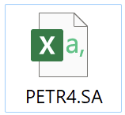
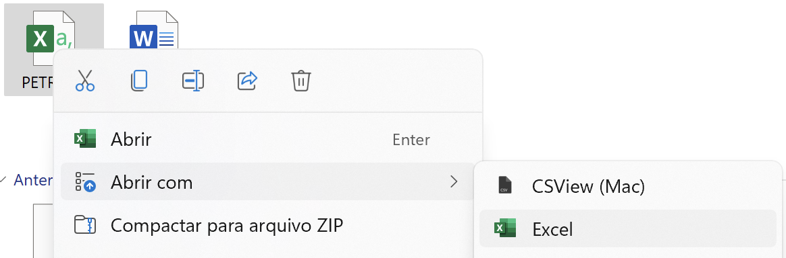
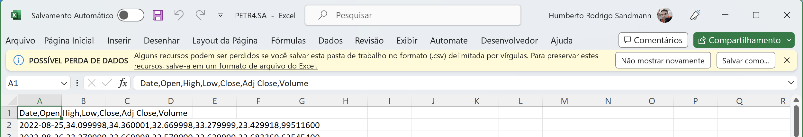
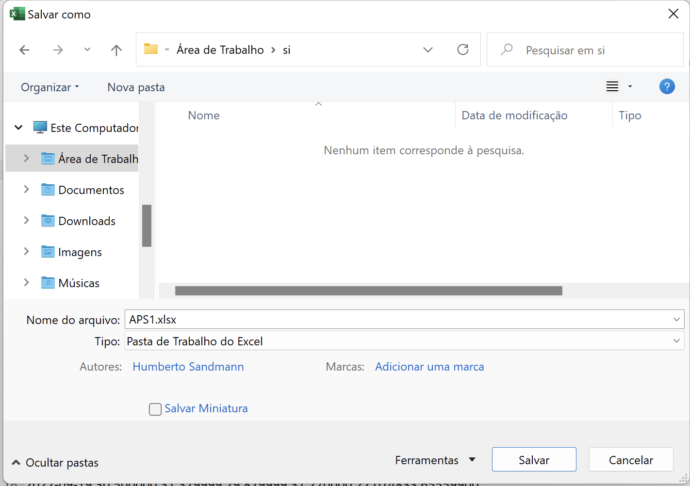
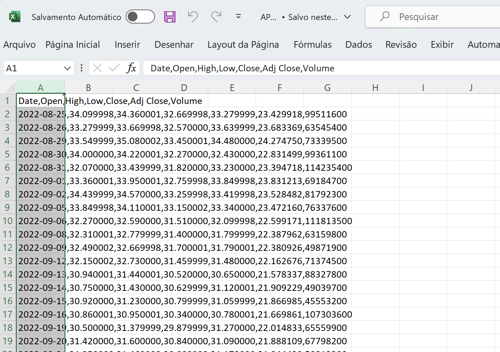
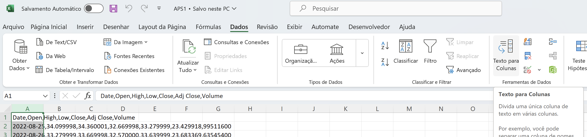
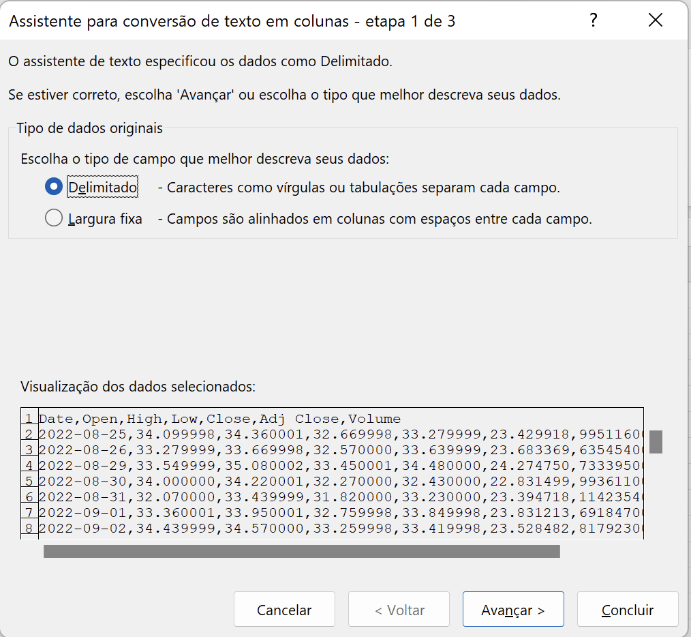
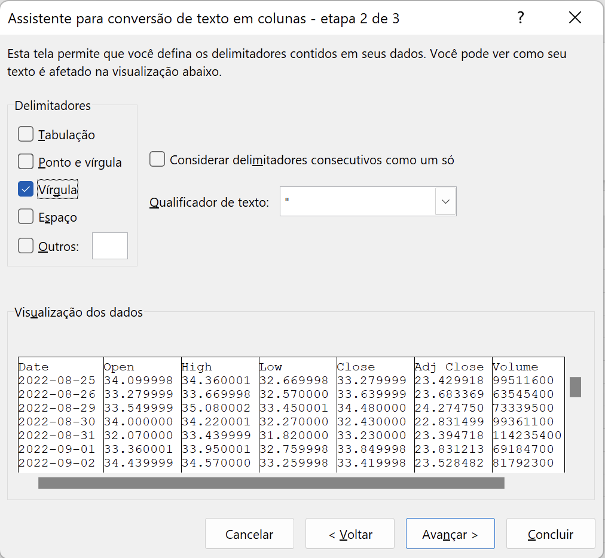
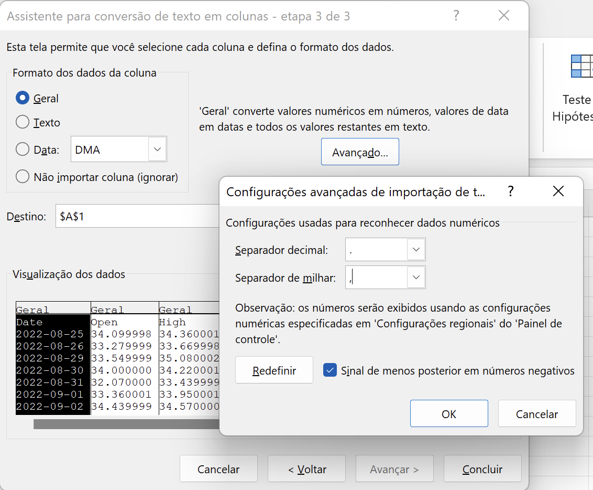
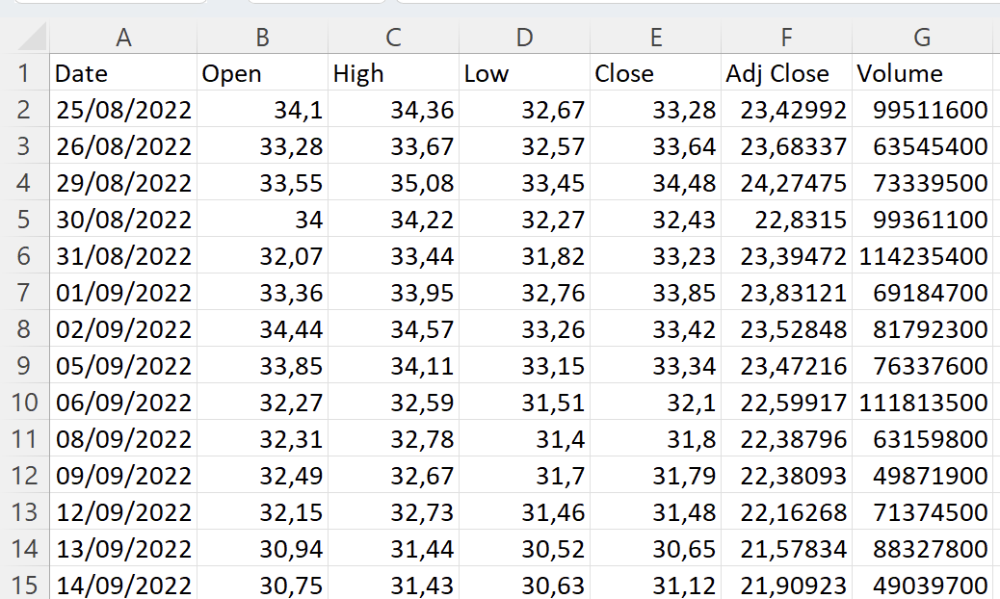

# INSPER :: SISTEMAS DE INFORMAÇÃO

**APS :: ATIVIDADE PRÁTICA SUPERVISIONADA : 2023.2**

*[Prof. Humberto Sandmann](https://hsandmann.github.io/)*

[humbertors@insper.edu.br](emailto:humbertors@insper.edu.br)

**Proposta:**

> **MACD - Moving Average Convergence/Divergence**
>
> [Investopedia - MACD](https://www.investopedia.com/terms/m/macd.asp)

**Entregas:**

* Local de entrega: **Blackboard**. Não existe entrega por quaisquer outros meios.
* Prazo: cada APS tem sua data de entrega, sendo que sua execução comtempla tempo hábil, sendo assim, entregas fora do prazo não serão consideradas, portanto, evite o risco de envio nos últimos instantes, faça entregas parciais, se necessário - APENAS A ÚLTIMA ENTREGA SERÁ CONSIDERADA.
* Cada grupo deverá submeter seu relatório no login de um único membro do grupo. Grupos que submeterem material em mais de um login de membro sofrerão punição na nota, portanto, organizem-se.
* O feedback a respeito da APS será dado através do login do aluno que submeteu o relatório, ficando este responsável por repassar o feedback aos demais integrantes do grupo.
* Na ocorrência de um ou mais membros do grupo não estejam participando dos trabalhos, cabe aos demais membros - **o quanto antes** - avisar ao Professor e caso não seja encontrada uma solução amigável, os executores do trabalho **NÃO** devem colocar o nome do aluno na capa do trabalho relalando o ocorrido ao Professor pelo e-mail: [humbertors@insper.edu.br](emailto:humbertors@insper.edu.br), com cópia a todos alunos do grupo, **inclusive** ao(s) aluno(s) excluído(s).
* Formato da entrega: relatório em **Word** (docx), dentro dos padrões da ABNT.

**Sumário:**

1. [APS-1](#aps-1)
2. [APS-2](#aps-2)
3. [APS-3](#aps-3)
4. [APS-4](#aps-4)

## 1 APS-1

> ENTREGA: **04 / setembro / 2023**

### 1.1 Introdução

Para esse primeiro trabalho, vamos nos ater apenas em medidas estatísticas e no cálculo mais simples da **MACD** e indicar suas classificações. Para análise do trabalho, o grupo deve-se ater somente às empresas da BOVESPA.

### 1.2 Aquisição de dados da BOVESPA

Como visto em sala de aula, pode-se adquirir dados de diversas fontes, entre elas o [Yahoo Finance!](https://finance.yahoo.com/) e [InfoMoney](https://www.infomoney.com.br/). Na versão do Yahoo Finance, o site tem o seguinte formato.

Para a aquisição dos dados basta escolher o símbolo (ticker) da ação (PETR4, USIM5, GGBR4, VALE3, BBASE3, etc... (consulte no site da Bovespa os símbolos) na caixa chamada de "Procurar cotações" conforme mostrado a seguir. O exemplo mostra a ação da Petrobras (PETR4).

Sempre se deve escolher a ação com final *.SA no site do Yahoo e nunca com a letra F. Por exemplo, no caso da Petrobras a ação deve ser PETR4.SA e não PETR4F.SA, ou seja, o correto é sem a letra F (as letras depois do número indicam outros tipos de operações).

Uma vez escolhida a ação, o web site direciona para uma tabela com diversas funções na tela. Na parte que descreve a ação, deve-se escolher na aba à direita o link **"Dados Históricos"**, como indicado a seguir.

Depois de clicar em "dados históricos", abre-se outra página. Observe que existe uma opção para escolher o período desejado. Escolha o período desejado (será definido na próxima seção) para começar a fazer o trabalho. Isso se chama frequência "diária". Não se esqueça de, depois de escolhido o período, clicar no botão **"APLICAR"**:

Logo abaixo do botão "Aplicar" há um link "download", ao clicar será iniciado um download de um arquivo com os dados com o formato ***.CSV** do Excel. Os dados vão ser baixados em formato do Excel, mas do tipo *.CSV, que é um formato de texto onde o Excel não consegue fazer nenhuma operação.

Na pasta de download de seu computador, o arquivo vai aparecer da seguinte forma:

#### Formatando o arquivo para o Excel

- Clique no arquivo *.CSV que foi baixado e abra ele no Excel.

- Note que o Excel avisa que você está abrindo um .CVS e quem alterações podem não ser salvas. Então, para evitar perdas futuras, clique na opção de **"Salvar como..."**.

Salve com extensão .XLSX (Pasta de Trabalho do Excel). É sugerido o nome de **aps1.xlsx** para o arquivo.

- Marque a **Coluna A** inteira que está completa com os dados em formato texto.

- Escolha na aba **"Dados"** o comando **"Texto para Colunas"** conforme mostrado a seguir:
 

- Siga os passos para formatar o texto como dados do Excel.

- Escolha o formato "delimitado"

- Clique em **"vírgula"**. Isso porque seus dados vieram do Yahoo separados por vírgula, pois o formato é texto. Cada vírgula indica o dado de uma coluna.

- Na próxima tela, etapa, escolher **"avançado..."** e trocar vírgulas por ponto decimal e ponto decimal por vírgula no separador de milhar. **ATENÇÃO: SE O SEU COMPUTADOR ESTIVER FORMATADO PARA INGLÊS, NÃO PRECISA FAZER ESSE PASSO, POIS O PONTO DECIMAL É O PADRÃO INGLÊS PARA CASAS DECIMAIS.**

- Agora, basta concluir.

Ao final, você deverá ter os dados no formato do Excel conforme mostrado abaixo. Verifique se o dados estão coerentes com os dados do site do Yahoo.

### 1.3 O que deve ser realizado?

### 1.4 O que deve ser entregue?

teste

## APS-2

> ENTREGA: **25 / setembro / 2023**

## APS-3

> ENTREGA: **16 / outubro / 2023**

## APS-4

> ENTREGA: **22 / novembro / 2023**
